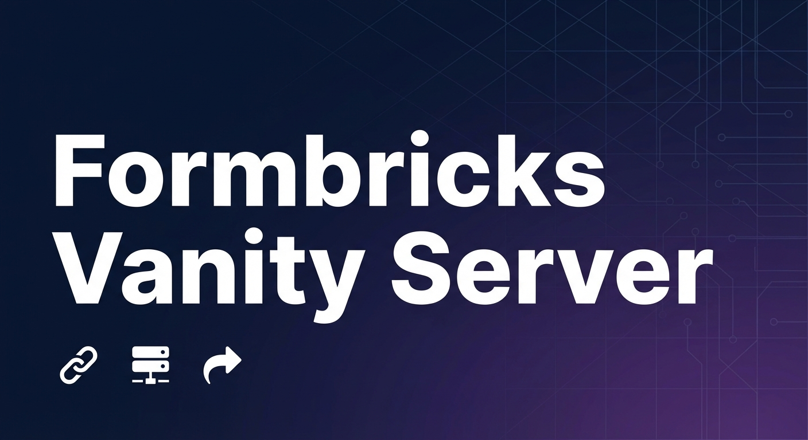

<div align="center">



# Formbricks Vanity Server

**Servidor de URLs personalizadas para encuestas de Formbricks con gestión inteligente de redirecciones**

[](https://www.docker.com/)
[](https://coolify.io/)
[](https://nodejs.org/)
[](LICENSE)

[Características](#características) •
[Instalación](#instalación-rápida) •
[Deployment](#deployment) •
[Documentación](#documentación)

</div>

---

## 🎯 Características

- **🔗 URLs Personalizadas**: Crea URLs amigables para tus encuestas de Formbricks
- **🎨 Admin UI**: Interfaz visual para gestionar aliases de proyectos
- **🔀 Redirección Inteligente**:
  - Encuestas tipo "link" → Redirigen automáticamente a Formbricks
  - Encuestas tipo "app" → Se embeben en tu servidor
- **🏢 Multi-Proyecto**: Soporte para múltiples ambientes de Formbricks
- **🐳 Docker Ready**: Listo para desplegar en Coolify, Docker, o cualquier plataforma de contenedores
- **💾 Persistencia**: Base de datos SQLite con sincronización automática desde Formbricks API

## 🚀 Instalación Rápida

### Opción 1: Docker (Recomendado)

```bash
docker run -d \
  -p 3011:3011 \
  -e FORMBRICKS_SDK_URL=https://your-formbricks-instance.com \
  -e FORMBRICKS_API_KEY=your_api_key \
  -e ADMIN_API_TOKEN=your_admin_token \
  -e BASE_DOMAIN=https://your-vanity-server.com \
  -v ./data:/app/data \
  --name formbricks-vanity \
  marcogll/soul23_form_mgr:latest
```

### Opción 2: Desarrollo Local

```bash
# Clonar repositorio
git clone https://github.com/your-username/formbricks-vanity-server.git
cd formbricks-vanity-server

# Instalar dependencias
npm install

# Configurar variables de entorno
cp .env.example .env
# Editar .env con tus credenciales

# Iniciar servidor
npm start
```

## 📦 Deployment

### Coolify (VPS)

Deployment en un solo click con Coolify. Ver [COOLIFY.md](./COOLIFY.md) para instrucciones detalladas.

**Configuración:**

- **Dominio**: `forms.soul23.cloud`
- **Puerto**: 3011
- **SSL**: Automático con Let's Encrypt

### Docker Hub

```bash
# Construir imagen
docker build -t your-username/formbricks-vanity-server:latest .

# Publicar a Docker Hub
docker push your-username/formbricks-vanity-server:latest
```

## 🎮 Uso

### 1. Configurar Admin UI

Accede a `https://your-vanity-server.com/admin` (o `http://localhost:3011/admin` en local)

1. Ingresa tu Admin Token
2. Configura aliases para tus proyectos:
   - `socias` → Environment de Formbricks
   - `vanity` → Otro environment

### 2. Acceder a Encuestas

Tus encuestas estarán disponibles en:

```
https://your-vanity-server.com/{alias}/{nombre-encuesta}
```

**Ejemplos:**

- `https://your-vanity-server.com/socias/Contratos` → Redirige a Formbricks
- `https://your-vanity-server.com/vanity/test` → Embebida en el servidor

## ⚙️ Configuración

### Variables de Entorno

| Variable             | Requerida | Descripción                         |
| -------------------- | --------- | ----------------------------------- |
| `FORMBRICKS_SDK_URL` | ✅        | URL de tu instancia de Formbricks   |
| `FORMBRICKS_API_KEY` | ✅        | API Key de Formbricks               |
| `ADMIN_API_TOKEN`    | ✅        | Token para acceder al Admin UI      |
| `PORT`               | ❌        | Puerto del servidor (default: 3011) |
| `FORMBRICKS_ENV_ID`  | ❌        | ID de ambiente (opcional)           |

Ver [.env.example](./.env.example) para más detalles.

## 📚 Documentación

- **[COOLIFY.md](./COOLIFY.md)** - Guía completa de deployment en Coolify
- **[DOCKER.md](./DOCKER.md)** - Guía general de Docker y Docker Compose
- **[.env.example](./.env.example)** - Plantilla de variables de entorno

## 🛠️ Tecnologías

<div align="center">

| Tecnología                                                                               | Uso              |
| ---------------------------------------------------------------------------------------- | ---------------- |
|   | Runtime          |
|  | Framework Web    |
|       | Base de Datos    |
|   | Containerización |

</div>

## 🏗️ Arquitectura

```
┌─────────────────┐
│   forms.soul23  │  ← URLs Personalizadas
│     .cloud      │
└────────┬────────┘
         │
         ├─ /socias/Contratos  ──→  302 Redirect ──→  feedback.soul23.cloud/s/{id}
         │                                              (Encuestas tipo "link")
         │
         └─ /vanity/test       ──→  Embedded Survey
                                     (Encuestas tipo "app")
```

## 🤝 Contribuir

Las contribuciones son bienvenidas. Por favor:

1. Fork el proyecto
2. Crea una rama para tu feature (`git checkout -b feature/AmazingFeature`)
3. Commit tus cambios (`git commit -m 'Add some AmazingFeature'`)
4. Push a la rama (`git push origin feature/AmazingFeature`)
5. Abre un Pull Request

## 📝 Licencia

Este proyecto está bajo la Licencia MIT. Ver [LICENSE](LICENSE) para más detalles.

## 🙏 Agradecimientos

- [Formbricks](https://formbricks.com/) - Plataforma de encuestas open-source
- [Coolify](https://coolify.io/) - Plataforma de deployment self-hosted

---

<div align="center">

**Hecho con ❤️ para la comunidad de Formbricks**

[⬆ Volver arriba](#formbricks-vanity-server)

</div>
